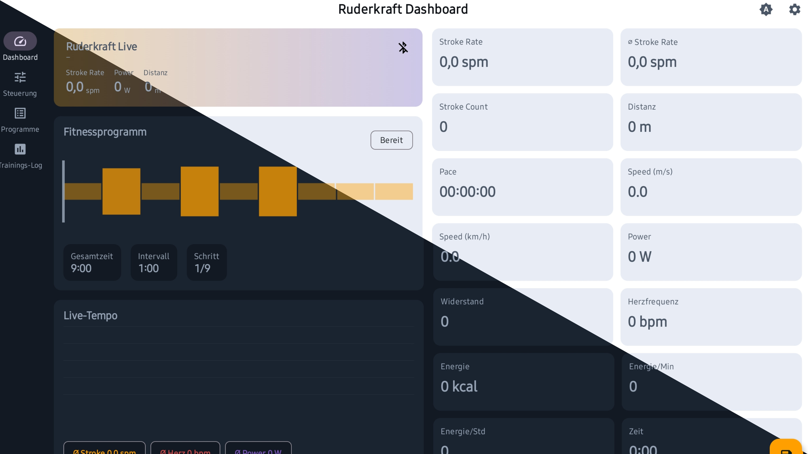
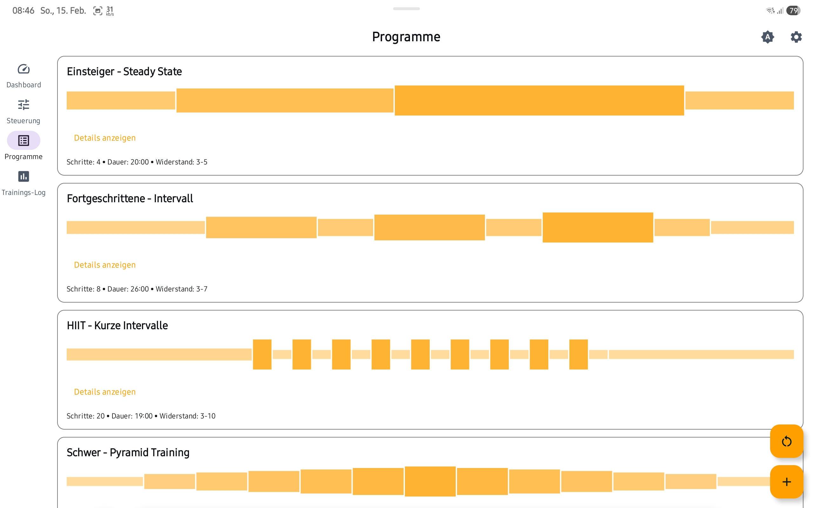
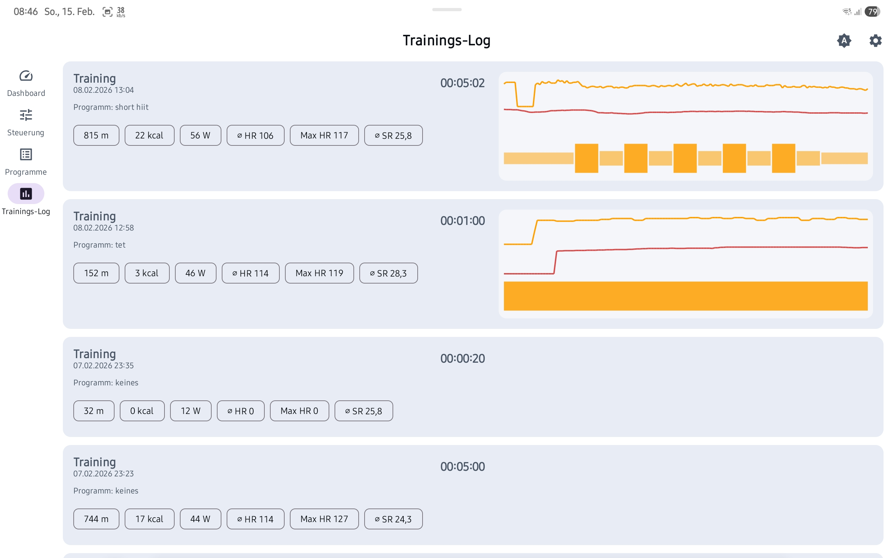
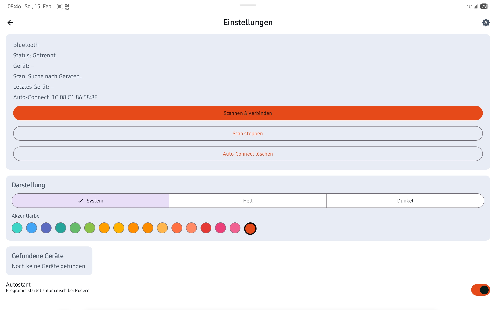

## Ruderkraft 

Ruderkraft was built for the **Decathlon Domyos Woodrower** and is an **FTMS‑based fitness app**.
It not only shows all relevant training metrics, but also lets you build your own workouts with different resistance levels to keep training varied.

### Highlights
- Live view of the most important training data
- Custom workouts with variable resistance
- Intuitive editor to define workouts in sections
- Advanced editor for quick text‑based definitions
- Light & dark mode plus a customizable accent color
- Optimized for Android tablets, works just as well on Android phones
- Training history to track your progress

### Live data
Displayed metrics include:
- **Total time**
- **Distance (meters)**
- **Strokes**
- **Cadence**
- **Pace**
- **Calories**
- **Resistance**

### Advanced editor: workout definition
The advanced editor accepts a simple text format:

`Duration@Resistance, Duration@Resistance, ...`

Example:
`300@3, 240@5, 120@4`

Meaning:
- **Duration** in seconds
- **Resistance** as a level

This makes it easy to define intervals quickly and precisely.

### Compatibility
Because FTMS is used, other Domyos rowing machines may work as well. This has not been verified.

### System requirements
- **Android 8.0 (API 26)** or newer

### Free & ad‑free
The app is **completely free**, contains **no ads**, and uses **no tracking**.

### Disclaimer
**Hobby project. Use at your own risk.**
No liability is accepted for any damages.

### Screenshots 

# License

Copyright (c) 2026 [@ptc]  
All rights reserved.

## Grant of License

Permission is granted to download and use the compiled version of this software for personal, non-commercial purposes only.

## Restrictions

You may not:

- Use this software for commercial purposes.
- Copy, modify, adapt, or create derivative works.
- Distribute, sublicense, sell, rent, lease, or otherwise transfer the software.
- Reverse engineer, decompile, or disassemble the software, except where mandatory law expressly permits it.
- Access, use, or claim any rights to the source code.

## No Source Code Rights

This license does not grant any rights to the source code.

## Termination

Any violation of these terms automatically terminates your rights under this license.